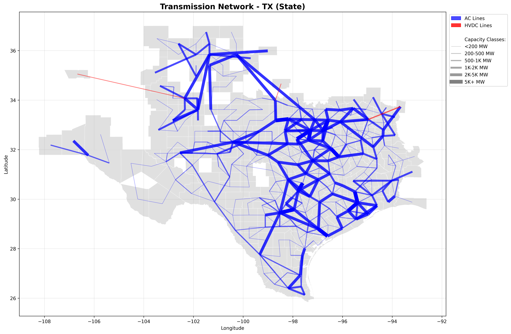

# Transmission Network Analysis

A Python toolkit for aggregating and visualizing electricity transmission networks at the county level from MATPOWER-style grid datasets.

[](https://opensource.org/licenses/MIT)
[](https://www.python.org/downloads/)

## 🔧 Features

- **Transmission Aggregation**: Convert MATPOWER bus/branch data to county-level transmission edges
- **HVDC Support**: Analyze both AC and HVDC transmission lines
- **Geospatial Mapping**: Create detailed maps with capacity-based line visualization
- **Interactive Visualizations**: Generate interactive HTML maps with hover details
- **Regional Filtering**: Focus on specific states, zones, or interconnects
- **Capacity Classes**: Visual distinction across 6 capacity ranges (<200MW to 5K+MW)

## 📊 Dataset Overview

The processed dataset contains **7,652 transmission edges** with:
- **7,637 AC transmission lines**
- **15 HVDC transmission lines**
- **21 data columns** including geographic, network, and capacity information
- **Complete US coverage** across Eastern, Western, and Texas interconnects

## 🚀 Quick Start

### 1. Installation

```bash
git clone https://github.com/yourusername/transmission-network-analysis.git
cd transmission-network-analysis
pip install -r requirements.txt
```

### 2. Data Preparation

Place your MATPOWER dataset in the `data/base_grid/` folder or download the sample dataset:

```bash
# The base_grid folder should contain:
# - bus.csv, branch.csv, sub.csv, bus2sub.csv
# - dcline.csv (for HVDC), zone.csv
```

### 3. Generate Transmission Data

```bash
python src/run_transmission.py
```

This creates `outputs/county_edges_tx.csv` with all transmission edges.

### 4. Create Visualizations

```bash
# Texas transmission network
python src/visualize_transmission.py --region "TX" --type state --output outputs/texas.png

# Interactive California map
python src/visualize_transmission.py --region "CA" --type state --output outputs/california.html --interactive

# Western Interconnect overview
python src/visualize_transmission.py --region "Western" --type interconnect --output outputs/western.png
```

### 5. Run Examples

```bash
python examples/generate_examples.py
```

## 🗺️ Visualization Examples

### Texas Transmission Network


### Capacity Classes
The visualization system uses 6 capacity classes for clear visual distinction:

- **< 200 MW**: Thin lines (local distribution)
- **200-500 MW**: Light lines (sub-transmission) 
- **500-1K MW**: Medium lines (transmission)
- **1K-2K MW**: Thick lines (high voltage)
- **2K-5K MW**: Very thick lines (extra high voltage)
- **5K+ MW**: Thickest lines (ultra high voltage corridors)

## 📁 Project Structure

```
transmission-network-analysis/
├── src/                          # Core source code
│   ├── run_transmission.py       # Main aggregation script
│   ├── visualize_transmission.py # Visualization engine
│   └── grid2county_txcap.py     # Aggregation functions
├── examples/                     # Example scripts and outputs
│   ├── generate_examples.py     # Create sample visualizations
│   └── README.md                # Examples documentation
├── data/                        # Input data
│   ├── base_grid/              # MATPOWER grid data
│   └── counties/               # US county shapefiles
├── outputs/                     # Generated results
│   ├── county_edges_tx.csv     # Main output dataset
│   └── README.md               # Output documentation
├── tests/                       # Unit tests
├── docs/                        # Documentation
├── requirements.txt            # Python dependencies
├── .gitignore                 # Git ignore rules
└── README.md                  # This file
```

## 🔍 Data Schema

The output `county_edges_tx.csv` contains 21 columns:

### Geographic Information
- `from_fips`, `to_fips`: County FIPS codes
- `from_county`, `to_county`: County names
- `from_state`, `to_state`: State abbreviations
- `from_lat`, `from_lon`, `to_lat`, `to_lon`: Coordinates

### Network Information  
- `from_zone_id`, `to_zone_id`: Zone identifiers
- `from_zone_name`, `to_zone_name`: Zone names
- `from_interconnect`, `to_interconnect`: Interconnect regions

### Transmission Details
- `total_capacity_mw`: Combined transmission capacity
- `edge_type`: 'AC' or 'HVDC'
- `num_circuits`, `num_links`: Circuit/link counts
- `total_impedance`: Electrical characteristics

## 🎯 Use Cases

- **Grid Planning**: Identify transmission bottlenecks and expansion needs
- **Policy Analysis**: Analyze inter-regional transmission capabilities
- **Research**: Academic studies on power system topology
- **Education**: Teaching power systems geography and capacity
- **Visualization**: Create publication-quality transmission maps

## 🧪 Testing

Run the test suite:

```bash
python -m pytest tests/
```

## 📖 Documentation

Detailed documentation is available in the `docs/` folder:
- [API Reference](docs/api.md)
- [Data Format Guide](docs/data_format.md)
- [Visualization Guide](docs/visualization.md)

## 🤝 Contributing

Contributions are welcome! Please see our [Contributing Guide](CONTRIBUTING.md) for details.

## 📄 License

This project is licensed under the MIT License - see the [LICENSE](LICENSE) file for details.

## 🙏 Acknowledgments

- MATPOWER for the grid data format
- US Census Bureau for county shapefiles
- Python geospatial community (GeoPandas, Shapely, etc.)

## 📞 Contact

- **Author**: [Your Name]
- **Email**: [your.email@institution.edu]
- **Institution**: [Your Institution]

---

*For questions about the underlying grid dataset or methodology, please refer to the documentation or open an issue.*
